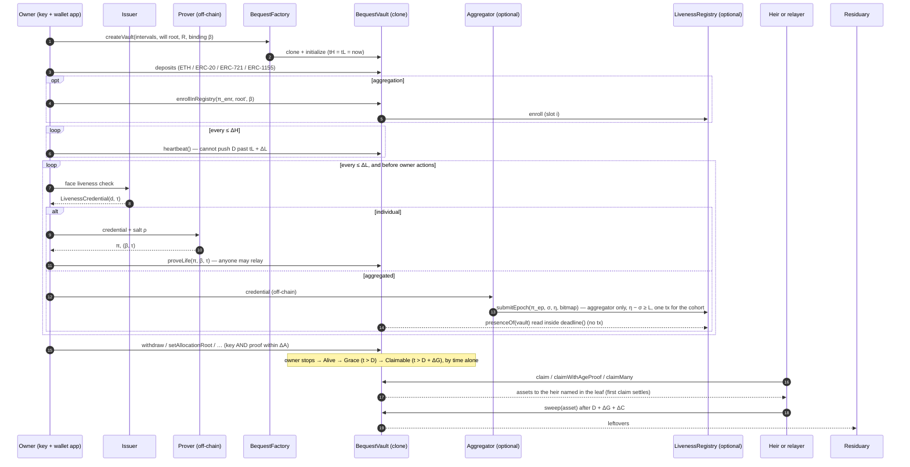

# Bequest: technical manual

Trustee-free, privacy-preserving succession of on-chain assets, driven by zero-knowledge proofs of life.
This manual is the reference for the contracts, circuits, tests and the live Sepolia run.

- **Per-owner vault** (`src/BequestVault.sol`), an EIP-1167 clone created by `src/BequestFactory.sol`. The vault address is also the deposit address: send it ETH, ERC-20, ERC-721 or ERC-1155 tokens with plain transfers.
- **Proof of life** (`circuits/liveness.circom`, 16,253 constraints). A Groth16 proof that an attestation issuer (e.g. Privado ID / Billions) signed a biometric `LivenessCredential` for the owner's DID at time `t`. The DID stays hidden: the vault only stores `Poseidon(issuerKey, DID, salt)`.
- **Bounded key-only heartbeats.** They are cheap, but can never push the deadline past `lastLifeProof + lifeProofInterval`. Moving assets or changing the will also needs a proof of life from the last `AUTH_WINDOW`.
- **Zero-transaction lifecycle.** Alive → Grace → Claimable is computed from timestamps, so no keeper transactions are needed.
- **Merkle-committed will.** Heirs, shares, time-locks and age limits live in one root. Heirs claim independently; fungible pools are split pro rata.
- **Age gate** (`circuits/age.circom`, 336 constraints). Proves `birthDate <= cutoff` against `Poseidon(birthDate, salt)`. The vault derives the admissible cutoff from `block.timestamp`.

## Layout

| Path | What |
|---|---|
| `src/` | vault, factory, liveness registry, generated Groth16 verifiers |
| `circuits/` | Circom circuits; `lib/` holds the shared proof-of-life, Merkle and batch templates |
| `scripts/zk-setup.sh` | Groth16 setup (PSE perpetual powers of tau) and verifier export |
| `scripts/batch-setup.sh` | setup for the enrollment and epoch-aggregation circuits → `zk/batch/` |
| `js/lib/` | credential parsing and merklization, test issuer, will builder, Poseidon tree, prover |
| `js/gen-fixtures.mjs` | regenerates `test/fixtures/*.json` |
| `js/gen-batch-fixtures.mjs` | aggregation fixtures and prover benchmark → `reports/aggregation.json` |
| `js/bench-proving.mjs` | proving-time benchmark → `reports/proving.json` |
| `js/demo.mjs` | off-chain half of the live demo (`prepare`, `life`, `ages`, `agg`, `report`) |
| `test/` | unit, invariant and gas tests |
| `script/` | `Deploy.s.sol`, `Demo.s.sol`, `DemoAgg.s.sol` |
| `fixtures/private/` | real credentials. **Git-ignored; never publish.** |

### Aggregated proof of life

`LivenessRegistry` records, epoch by epoch, which members of an enrolled cohort proved they were
alive. One proof and one transaction cover the whole cohort, and a vault reads its presence from
the registry as a view, so an epoch advances every member's deadline without any of them sending
a transaction. The circuit is a conjunction of single-principal proof-of-life instances, so an
aggregator can decline to include someone but can never make a silent principal appear alive;
anyone omitted falls back to the ordinary `proveLife` path.

Two rules keep a recorded presence from being hidden. An all-zero bitmap needs no credential, so
only the registry's designated `AGGREGATOR` may submit epochs, and every epoch must last at least
`MIN_EPOCH_LENGTH` (L). A vault scans `REGISTRY_LOOKBACK` (k) epochs and accepts only timers with
ΔL + ΔG + 15 min < k·L (`REGISTRY_SPAN`), so a presence can leave the scan only after it has
stopped keeping the vault alive. `test/Registry.t.sol` floods the registry with the shortest
epochs allowed to check exactly this.

## Contract reference

The paper (§5) points here for the full reference of state variables and public functions and
for the sequence diagram. Gas is transaction gas from `reports/gas-ops.json` and
`reports/gas-aggregation.json` (Foundry `--isolate`, cold accesses). Symbols follow the paper:
tH = `lastHeartbeat`, tL = `lastLifeProof`, ΔH, ΔL, ΔG, ΔC the four intervals, ΔA = `AUTH_WINDOW`.

**Deadline and phases.** D = min(max(tH, tL') + ΔH, tL' + ΔL), where tL' is the later of
`lastLifeProof` and the registry's presence for this vault. Alive while now ≤ D; Grace until
D + ΔG; Claimable afterwards; Settled after the first claim or sweep; sweepable after D + ΔG + ΔC.

### BequestVault state

| Variable | Purpose | Written by | Constraint / lifecycle |
|---|---|---|---|
| `owner` | the key holder O | `initialize` | fixed; the implementation is locked with `0xdead` |
| `lastHeartbeat` (tH) | last key signal | `heartbeat`, `proveLife` (max(tH, τ)), `syncFromRegistry`, `initialize` | monotone; its effect is capped at tL + ΔL |
| `lastLifeProof` (tL) | liveness time of the last accepted proof | `proveLife`, `syncFromRegistry`, `initialize` | strictly increasing, and only via a valid proof |
| `lifeProven` | a real proof of life has been accepted | `proveLife`, `syncFromRegistry` | the creation time never authorises owner actions |
| `settled` | payout has started | first `claim` or `sweep` | irreversible |
| ΔH, ΔL, ΔG, ΔC | the four intervals | `initialize`, `setTimers` | whole minutes, ≥ `MIN_PERIOD`, ≤ 2^24 − 1 minutes; with a registry, ΔL + ΔG + 15 min < `REGISTRY_SPAN` |
| `residuary` (R) | receives leftovers | `initialize`, `setResiduary` | non-zero |
| `allocationRoot` | Merkle root of the will | `initialize`, `setAllocationRoot` | — |
| `isBinding[β]` | registered issuer/DID bindings | `initialize`, `setBinding` | β ≠ 0; one per issuer |
| `paidBps[pool]` | basis points paid per fungible pool | claims | ≤ 10,000 |
| claimed bitmap | double-claim protection | claims | set before any external call |
| `LIVENESS_VERIFIER`, `AGE_VERIFIER` | Groth16 verifiers | constructor | immutable |
| `MIN_PERIOD`, `AUTH_WINDOW` (ΔA) | interval floor; maximum age of a proof for owner actions | constructor | immutable per deployment |
| `REGISTRY`, `REGISTRY_LOOKBACK` (k) | optional liveness registry; epochs scanned | constructor | `address(0)` disables aggregation; 1 ≤ k ≤ the registry's `MAX_LOOKBACK` |
| `REGISTRY_SPAN` | k × the registry's `MIN_EPOCH_LENGTH`: the least time k epochs can span | constructor | bounds every vault's ΔL + ΔG (see above) |

### BequestVault and factory functions

| Function | Caller | Allowed when | Effect | Gas |
|---|---|---|---|---|
| `factory.createVault(cfg, salt)` | anyone (becomes owner) | once per (owner, salt) | CREATE2 clone + `initialize`; tH = tL = now; the initial binding gets threshold 1 | 168,899 |
| `heartbeat()` | owner | not settled | tH = now | 30,049 |
| `proveLife(π, β, τ)` | anyone | not settled; β registered with threshold 1; tL < τ ≤ now + 15 min; proof valid | tL = τ; tH = max(tH, τ); `lifeProven` = true | 237,400 |
| `proveLifeMulti(π[], β[], τ[])` | anyone | not settled; β strictly increasing (distinct issuers); every β registered with threshold ≤ n; every τ as in `proveLife`; every proof valid | tL = min τ; tH = max(tH, tL) | 444,167 (n = 2) |
| `withdraw(kind, token, id, amount, to)` | owner | not settled; proof of life within ΔA | transfer out | 37,855 (ETH); plus a presence read with a registry |
| `setAllocationRoot(root)` | owner | as `withdraw` | new will | 30,535 |
| `setBinding(β, allowed)` | owner | as `withdraw` | add (threshold 1) or remove an issuer binding | 68,465 (registry-enabled vault) |
| `setBindingThreshold(β, j)` | owner | as `withdraw` | register or update an issuer binding with threshold j (0 removes it); with every binding at j, j − 1 compromised issuers cannot extend the deadline | 51,053 (new) / 33,965 (update) |
| `setResiduary(R)`, `setTimers(…)` | owner | as `withdraw` | update configuration | — |
| `claim(leaf, path)` | anyone | now > D + ΔG (or settled); now ≥ notBefore; minAge = 0 | pay the named heir; the first claim settles | 79,937 (ERC-721) – 125,967 |
| `claimWithAgeProof(leaf, path, π, κ)` | anyone | as `claim`; minAge > 0; κ ≤ cutoff(now, minAge) | pay the named heir | 291,603 (ERC-20) |
| `claimMany`, `claimManyWithAgeProof` | anyone | per leaf | several payouts in one transaction | — |
| `sweep(kind, token, id)` | anyone | now > D + ΔG + ΔC | settle; send the balance to R | 62,827 (ERC-20) / 68,259 (ETH) |
| `enrollInRegistry(π, root', β)` | owner | not settled; β registered here with threshold 1 | claim a registry slot | 325,982 |
| `syncFromRegistry()` | anyone | registry presence newer than tL | cache the registry's presence in tL | 48,270 |
| views | anyone | always | `deadline`, `claimableAt`, `status`, `presence`, `registryLifeProof`, `isClaimed`, `ageCutoff` | 0 off-chain; a registry read inside a transaction costs 20,309 (present in the latest epoch) to 170,217 (absent from all 64 scanned), `reports/gas-presence-read.json` |

### LivenessRegistry

| Item | Purpose | Constraint |
|---|---|---|
| `enrollRoot` | root of the depth-16 Poseidon enrollment tree | changes only through a valid enrollment proof |
| `nextSlot`, `bindingAt[slot]` | slot allocation; binding per slot | sequential; one slot per principal address |
| epochs, `attendance[epoch][word]` | epoch windows and presence bitmaps | non-overlapping, and no end later than now + 15 min |
| `AGGREGATOR` | the only epoch submitter | constructor (`address(0)` means the deployer) |
| `MIN_EPOCH_LENGTH` (L) | shortest accepted epoch, `end − start` in seconds | constructor |
| `enroll(π, root', β)` (325,954 gas) | claim the next slot | proof that only the next slot changed, from empty to β |
| `submitEpoch(π, start, end, words)` (318,542 gas cold, 303,866 warm for one word, 16 principals) | record one epoch for the whole cohort | `AGGREGATOR` only; end − start ≥ L; the proof covers every set bit |
| `presenceOf(principal, lookback)` | binding and start of the most recent attended epoch | view; lookback ≤ `MAX_LOOKBACK` |

### Diagrams

The vault's status is a function of time alone (first diagram); the second shows the messages of
one vault's life. Editable sources: [`lifecycle.drawio`](docs/diagrams/lifecycle.drawio) and
[`sequence.drawio`](docs/diagrams/sequence.drawio) (open them in draw.io; vector PDFs and SVGs
are next to them).


<details><summary>The sequence diagram as text (Mermaid)</summary>



</details>

## Build and test (local)

Git Bash: `export PATH="$PATH:$HOME/.foundry/bin"`. PowerShell: `$env:Path += ";$env:USERPROFILE\.foundry\bin"`.

```bash
npm install
forge build
forge test                                                     # 90 tests (vault, registry, thresholds, invariants, benchmarks)
python scripts/count_tests.py                                  # per-suite counts -> reports/forge-tests.json
WRITE_REPORTS=true forge test --match-contract BoundSweep      # posthumous-key bound, 5 timer settings -> reports/bound-sweep.json
bash scripts/halmos.sh                                         # symbolic proofs (pip install halmos) -> reports/halmos.json
python scripts/paper_numbers.py                                # every measured number in the paper -> ../latex/numbers.tex
# all gas reports (reports/gas-*.json, comparison.json, gas-presence-read.json):
WRITE_REPORTS=true forge test --match-contract "GasBenchmark|Comparison|ProofSystems|RegistryGas" --isolate -vv
node js/bench-proving.mjs 20                                   # proving times -> reports/proving.json
```

Rebuilding the circuits and keys (`bash scripts/zk-setup.sh`, `bash scripts/batch-setup.sh`)
changes the verifier contracts. Rerun `node js/gen-fixtures.mjs` and `node js/gen-batch-fixtures.mjs`
afterwards. The aggregation circuits are sized by the `2^18` powers of tau in `zk/ptau/`: at the
production merklization depth of 40 a cohort costs about 20,700 constraints per principal, so
`N_SWEEP` tops out at 8. A larger ptau is needed for bigger cohorts.

### Symbolic verification (Halmos)

`test/halmos/VaultSymbolic.t.sol` proves properties P1-P9 of the vault and R of the registry with
Halmos 0.3.3. Each check starts from an arbitrary vault (slots 0-2 overwritten with fresh symbols,
all mappings symbolic storage), assumes only reachable facts (initialized owner, no stored time in
the future, block time below 2^40 - 15 min), applies an arbitrary call (`svm.createCalldata`) from an
arbitrary sender, and asserts the property. The Groth16 verifiers are replaced by `SymVerifier`,
whose answer is an unconstrained boolean. `test/halmos/Sanity.t.sol` holds two deliberately false
properties that Halmos must refute. `scripts/halmos.sh` runs every check separately with the
`yices-smt2` solver shipped by the `yices-solver` pip package (loop bound 2, arrays of length 1, or
1 and 2 where arrays are the subject) and writes `reports/halmos.json` and `evidence/logs/halmos-*.log`.

The paper's "11 checks" are exactly these (results in `reports/halmos.json`):

| Paper label | Halmos check | Property |
|---|---|---|
| P1, P2 | `check_P1_heartbeatCannotExtendLiveness` | a heartbeat changes only t_h (P1); afterwards D <= t_l + Delta_l (P2) |
| P3 | `check_P3_livenessTimeOnlyByAcceptedProof` | t_l only grows, never lies ahead, moves only by accepted proofs |
| P4 | `check_P4_settlementIsFinal` | settlement is final; nothing revives or rewrites a settled vault |
| P5 | `check_P5_noSettlementBeforeGrace` | no settlement before D + Delta_g, no sweep before D + Delta_g + Delta_c |
| P6 | `check_P6_ownerActionsNeedKeyAndFreshProof` | will, bindings, R, timers, withdrawals need sk_O and a proof <= Delta_a old |
| P7a | `check_P7_claimedBitsNeverCleared` | a claimed bequest stays claimed |
| P7b | `check_P7_doubleClaimReverts` | a second claim of the same bequest reverts |
| P8 | `check_P8_poolsNeverOverPaid` | no pool is paid beyond 10^4 basis points |
| P9a | `check_P9_singleProofNeedsThresholdOne` | a single-issuer proof counts only under threshold 1 |
| P9b | `check_P9_multiProofMeetsThreshold` | a multi-issuer proof needs distinct, fresh bindings of threshold <= n |
| R | `check_R_epochsOnlyByAggregatorAndWellFormed` | only the aggregator adds epochs; each >= L long; no overlap |

Negative controls (must be refuted, and are): `check_NEG_livenessNeverChanges`, `check_NEG_rootNeverChanges`.

### Issuer thresholds

Each registered binding carries a threshold j (`bindingThreshold`). With j = 1 (the default) that
issuer's proof counts alone through `proveLife`; with j > 1 only `proveLifeMulti` counts, with proofs
under at least j distinct registered bindings, and it records the earliest of their liveness times.
Registry presence counts only for threshold-1 bindings. Tests: `test/Threshold.t.sol` (fixtures from
`node js/gen-threshold-fixtures.mjs`); live run: `bash scripts/sepolia_extras.sh threshold`.

## Browser app

[`dapp/`](dapp/) is a static web app (vanilla JavaScript, ethers v5 and snarkjs, bundled with
esbuild; no server) that drives the whole life cycle against the Sepolia deployment. A three-step
wizard creates a vault and its will; the dashboard shows the phase timeline and both clocks; proofs
of life are generated in the browser in a few seconds; heirs claim from a will package, with an
in-browser age proof for age-restricted bequests. It uses a demo liveness issuer whose signing key
is public, so its proofs of life only exercise the flow.

```bash
cd dapp && npm ci && npm test && npm run build     # dist/ is the static site
node tools/seed-demo.mjs create                       # demo vaults (needs a funded Sepolia test key)
```

## Live run on Sepolia

**One command does the whole run.** Put `PRIVATE_KEY=<test wallet key>` in `code/.env`, fund the
wallet with at least 0.05 Sepolia ETH, then from the `code` folder:

- PowerShell: `powershell -ExecutionPolicy Bypass -File scripts\sepolia_run.ps1`
- Git Bash: `bash scripts/sepolia_run.sh`

Do **not** type `bash scripts/sepolia_run.sh` in PowerShell: there `bash` is WSL's Linux bash,
which cannot see the Windows installs of forge, cast, node and python (the script detects this and
stops). The script first checks the tools, the key's format, the network (must be Sepolia) and the
balance, and sends nothing if any check fails. It then deploys fresh contracts, archives any
previous run under `evidence/previous-runs/`, and stops at the first step that fails. A complete
run ends with `Sepolia run complete: all 23 steps finished as expected`.

The manual steps below do the same thing one command at a time. Everything below runs from the `code` folder. The deployer key is stored in Foundry's encrypted keystore, and **no command ever prints or needs the raw key.**

### 1. One-time wallet setup

Use either of these; the scripts pick up whichever is present.

- **`.env` (simplest).** Create `code/.env` containing one line: `PRIVATE_KEY=0x<64 hex digits>`. Foundry loads it automatically, it is git-ignored, and the scripts never print it or put it on a command line. You can then drop `--account deployer` from the commands below.
- **Encrypted keystore.**
  ```bash
  cast wallet import deployer --interactive      # paste the key at the hidden prompt, then choose a password
  ```

About 0.05 Sepolia ETH covers the deployment and the whole demo.

### 2. Deploy (about 4.1M gas core + 3.2M gas demo tokens)

```bash
forge script script/Deploy.s.sol --rpc-url sepolia --account deployer --broadcast --slow
```

This writes `deployments/11155111.json`.

### 3. Prepare the will and the owner's binding

Pick **one** of the two modes and use it in both step 3 and step 5.

**(a) Real biometric credential (Billions / Privado ID).** Uses the issuer key and DID of your existing credential:

```bash
node js/demo.mjs prepare --credential fixtures/private/liveness-2025-12-14.json
```

**(b) Local test issuer.** Use this if you can't get a new face-scan credential today:

```bash
node js/demo.mjs prepare --test-issuer
```

### 4. Create the vault, deposit, heartbeat

The demo timers are short: heartbeat 10 min, proof of life 60 min, grace 5 min, claim window 30 min.

```bash
forge script script/Demo.s.sol --sig "create()"    --rpc-url sepolia --account deployer --broadcast --slow
forge script script/Demo.s.sol --sig "heartbeat()" --rpc-url sepolia --account deployer --broadcast --slow
```

### 5. Proof of life, then an owner withdrawal

For mode (a) you need a credential **issued after step 4**:
1. Do a new face scan in the Billions / Privado ID app.
2. Export the new `LivenessCredential` JSON the same way as before, and save it as `fixtures/private/liveness-new.json`.

An old credential is rejected on-chain by design: that is the replay protection.

```bash
node js/demo.mjs life --credential fixtures/private/liveness-new.json    # mode (a)
node js/demo.mjs life --test-issuer                                      # mode (b)
forge script script/Demo.s.sol --sig "proveLife()" --rpc-url sepolia --account deployer --broadcast --slow
forge script script/Demo.s.sol --sig "withdraw()"  --rpc-url sepolia --account deployer --broadcast --slow
```

### 5b. Aggregated proof of life

The vault claims an enrollment slot once, after which an epoch submitted by *anyone* counts as its
proof of life. Deploy must have been run with `AGG_EMPTY_ROOT` set (`scripts/sepolia_run.sh` does
this for you); otherwise no registry exists and these steps report that.

```bash
export AGG_AFTER=$(cast call "$VAULT" "lastLifeProof()(uint40)" --rpc-url sepolia | awk '{print $1}')
export AGG_NOW=$(cast block latest --field timestamp --rpc-url sepolia)
node js/demo.mjs agg                                 # enrollment + epoch proofs -> demo/agg.json
forge script script/DemoAgg.s.sol --sig "enroll()" --rpc-url sepolia --account deployer --broadcast --slow
forge script script/DemoAgg.s.sol --sig "status()" --rpc-url sepolia
forge script script/DemoAgg.s.sol --sig "epoch()"  --rpc-url sepolia --account deployer --broadcast --slow
forge script script/DemoAgg.s.sol --sig "status()" --rpc-url sepolia
```

Compare the two `status()` outputs. `registry tL` moves from 0 to the epoch's start and
`life proven` flips to true, while `local tL` --- what this vault's own transactions established
--- does not change. The epoch transaction would have covered every other member of the cohort at
the same cost. The epoch window is taken from the *chain's* clock, not the host's: a node that has
just mined many blocks runs ahead of wall time, and the contract compares against
`block.timestamp`.

### 6. Let the owner "die"

Send nothing for about 16 minutes. No transaction is needed for the vault to become claimable. Check with:

```bash
forge script script/Demo.s.sol --sig "status()" --rpc-url sepolia
```

### 7. Heirs claim

Claims are relayed by your account, and the funds go to the heirs' addresses.

```bash
node js/demo.mjs ages
forge script script/Demo.s.sol --sig "claimAll()" --rpc-url sepolia --account deployer --broadcast --slow
```

The time-locked tranche unlocks 25 minutes after step 3; run `claimAll()` again after that. The minor's age-restricted share can never be claimed. It stays in the vault until the sweep.

### 8. Sweep the residue and collect the gas report

About 30 minutes after the vault became claimable:

```bash
forge script script/Demo.s.sol --sig "sweep()" --rpc-url sepolia --account deployer --broadcast --slow
node js/demo.mjs report          # -> reports/sepolia.json (gas and tx hash of every transaction)
```

## Security notes

- The Groth16 phase-2 setup in `scripts/zk-setup.sh` has a single local contribution plus a beacon. That's fine for evaluation, but a production deployment must run phase 2 as a multi-party ceremony. Otherwise whoever ran the setup could forge proofs.
- The issuer's revocation status is not checked on-chain. A liveness credential is a signed, timestamped statement, and the vault only accepts proofs newer than the last accepted one.
