<div align="center">


# Succession Vault

**Trustee-free inheritance for NFTs and tokens, kept honest by private zero-knowledge proofs of life.**

[**Open the live app →**](https://sanjoy-chattopadhay.github.io/succession-vault/)
&nbsp;·&nbsp; [How it works](#how-it-works)
&nbsp;·&nbsp; [Screenshots](#screenshots)
&nbsp;·&nbsp; [Run it yourself](#run-it-yourself)
&nbsp;·&nbsp; [Technical manual](MANUAL.md)

[](https://github.com/Sanjoy-Chattopadhay/succession-vault/actions/workflows/ci.yml)
[](https://github.com/Sanjoy-Chattopadhay/succession-vault/actions/workflows/pages.yml)


[](LICENSE)

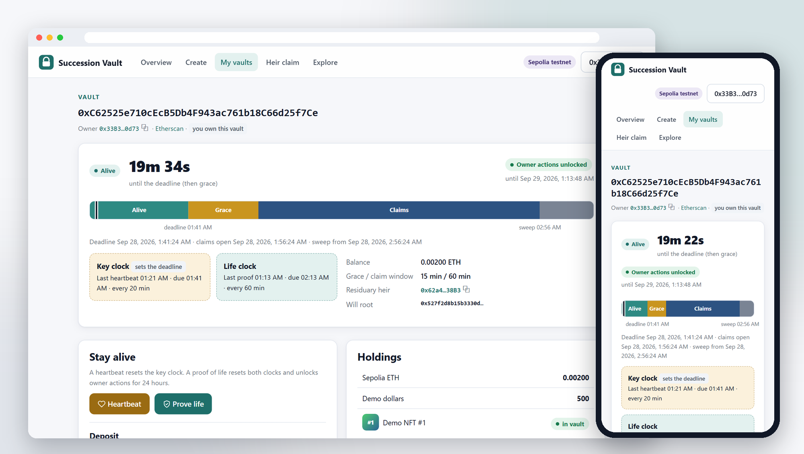

</div>

## Why

On a public blockchain, whoever holds the key holds the assets. Inheritance then forces a bad
choice: give the key to someone you must trust (a custodian, a lawyer, a relative, a seed phrase in
a drawer), or let everything die with you. Inactivity timers ("dead man's switches") look like a
fix, but they measure possession of the key, not the owner being alive: whoever finds the key can
keep resetting the timer forever, and the heirs never inherit.

Succession Vault separates **possession** from **presence**. The vault keeps two clocks:

| Clock | Reset by | Who can reset it | Unlocks |
|---|---|---|---|
| **Key clock** $\Delta_h$ | a heartbeat: any signature with the owner key | anyone who holds the key | nothing by itself |
| **Life clock** $\Delta_\ell$ | a zero-knowledge proof of life | only the living owner | owner actions for 24 h |

The vault stays alive until the earlier of the two runs out:

$$D = \min(t_h + \Delta_h,\ t_\ell + \Delta_\ell)$$

So a stolen or posthumously found key can delay the heirs by at most $\Delta_\ell$ after the owner's
last real proof of life, and it can never move assets or change the will without a fresh proof. The
chain learns a proof and a timestamp: not the owner's identity, not the credential, and not who the
heirs are until they claim.

## Features

- **A three-step vault wizard.** Timers, will, review. The vault's address is known before it
  exists (CREATE2), so it is also the deposit address for ETH, ERC-20, ERC-721 and ERC-1155 tokens.
- **Rich wills in one Merkle root.** NFTs go whole to one heir; token and ETH pools are split by
  percentage; shares can be age-gated or time-locked; a residuary heir gets whatever is left.
  Creating a will costs the same 169k gas for any number of heirs, and blinded leaves keep the root
  from revealing it.
- **Proof of life in the browser.** An issuer-signed liveness credential (iden3 format,
  EdDSA-Poseidon signature, JSON-LD merklization) becomes a Groth16 proof in a few seconds. Only a
  salted binding and a time reach the chain.
- **No keepers.** Alive → Grace → Claimable is computed from two timestamps; no one has to send a
  transaction for succession to start.
- **Heirs claim on their own.** Each heir gets a private will package with only their bequests.
  Anyone may relay a claim (the asset always goes to the named heir), and age-restricted shares are
  claimed with a zero-knowledge age proof made in the browser.
- **No backend.** The app is a static site that reads and writes the chain directly.

## Screenshots

All screenshots show real vaults on Sepolia: [`0xC625…f7Ce`](https://sepolia.etherscan.io/address/0xC62525e710cEcB5Db4F943ac761b18C66d25f7Ce)
(alive) and [`0x6AF5…fec6`](https://sepolia.etherscan.io/address/0x6AF55cFf0ACf499b95079f383B22aE83EB70fec6)
(its owner went silent, the heirs claimed, one of them with an age proof, and the rest was swept).
They are taken by [`dapp/tools/screenshots.mjs`](dapp/tools/screenshots.mjs).

### Create a vault

<table>
<tr>
<td width="50%">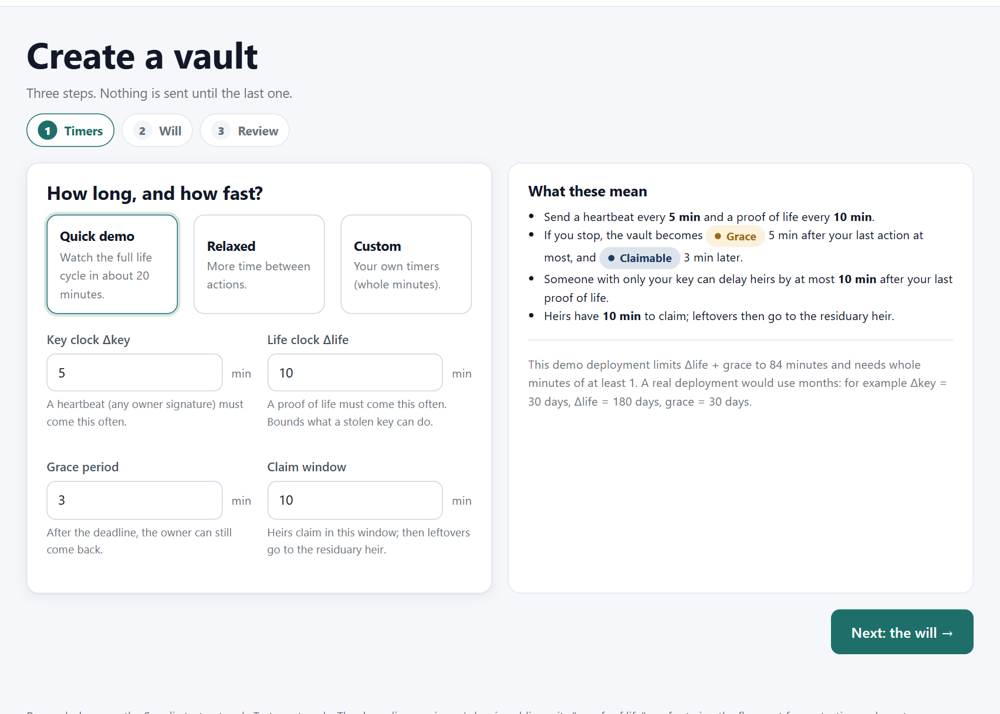</td>
<td width="50%">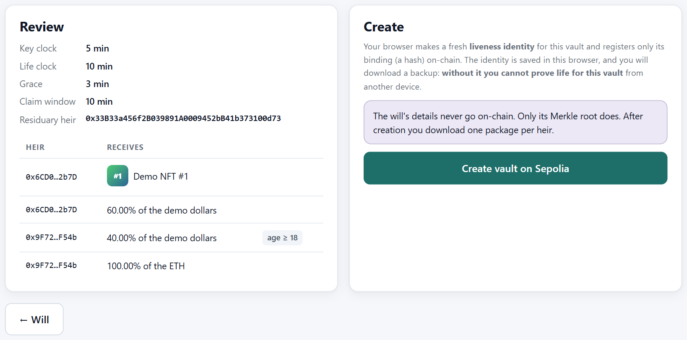</td>
</tr>
<tr>
<td>Pick the timers: from a 20-minute demo cycle to months in a real deployment.</td>
<td>Review and create. Only the will's Merkle root goes on chain; the app then hands out one package per heir.</td>
</tr>
</table>

<details>
<summary><b>The will editor</b>: NFTs, pools by percentage, age gates, time locks</summary>
<br>
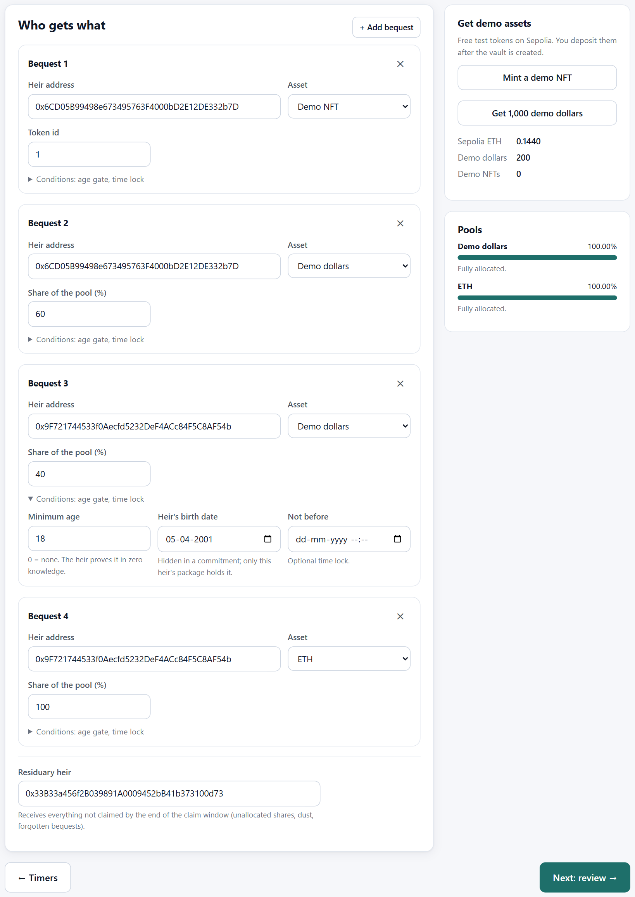
</details>

### Stay alive

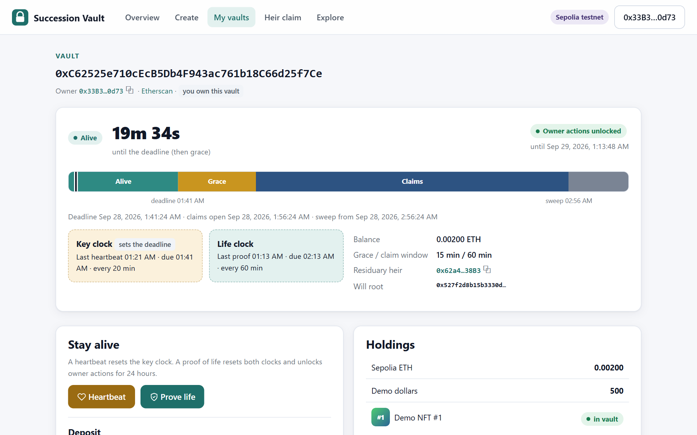

The dashboard shows a live countdown, the vault's phases on a timeline, and which clock sets the
deadline. A heartbeat resets the key clock; **Prove life** makes a zero-knowledge proof in the
browser, resets both clocks and unlocks withdrawals for a day.

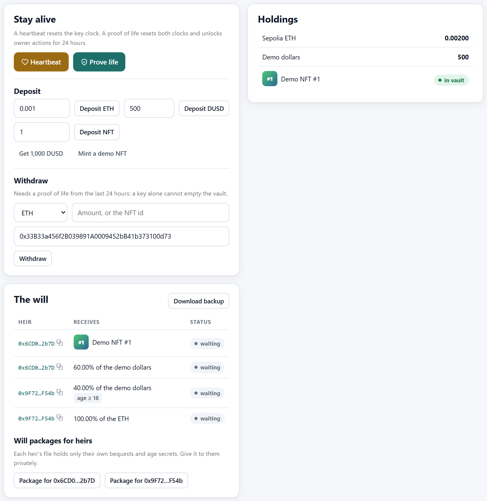

### Prove life without a wallet

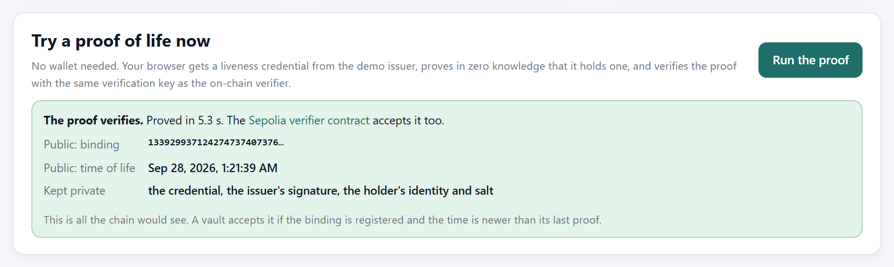

The overview page runs the whole proving pipeline in the browser, then asks the deployed Sepolia
verifier contract to check the proof (a free read-only call).

### Heirs claim

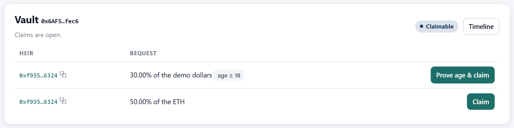
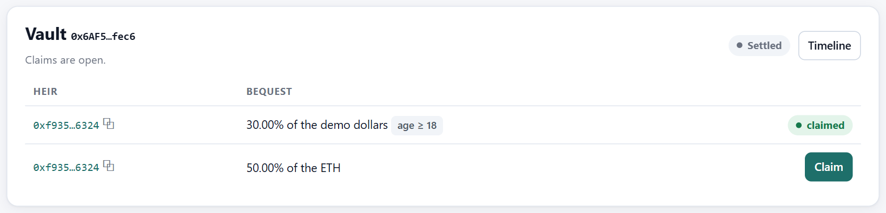

After the claim window, anyone can sweep what is left to the residuary heir:

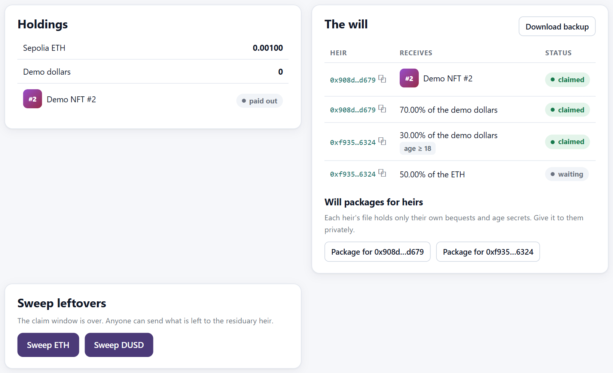

### Also

<table>
<tr>
<td width="38%">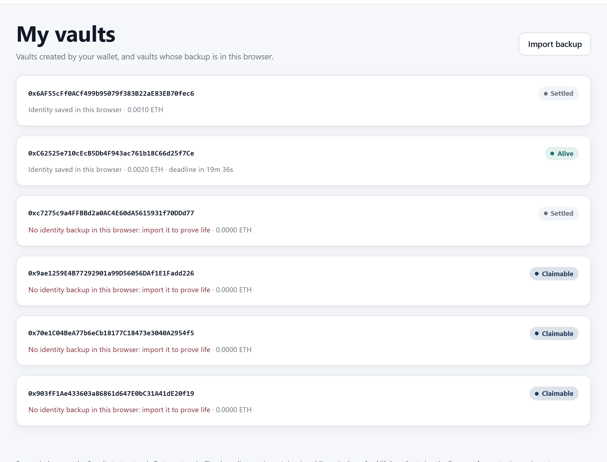</td>
<td width="42%">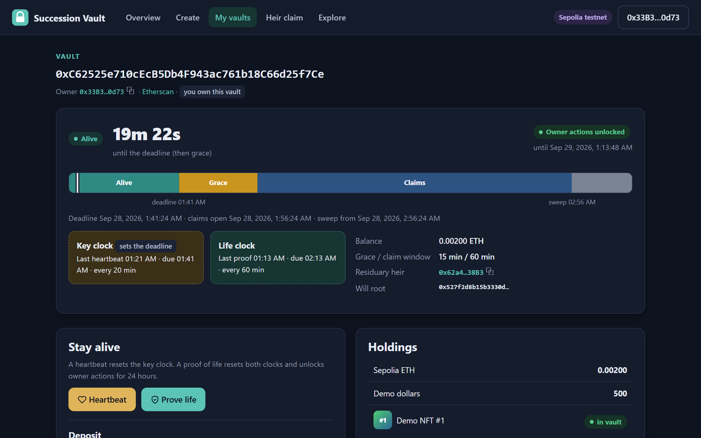</td>
<td width="20%">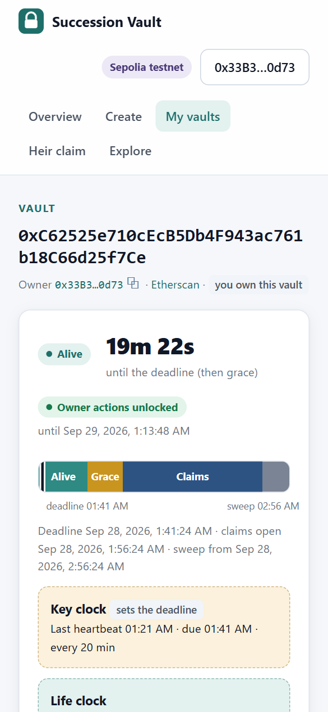</td>
</tr>
<tr><td>Your vaults, found from the factory's events</td><td>Dark mode</td><td>Phones</td></tr>
</table>

## How it works

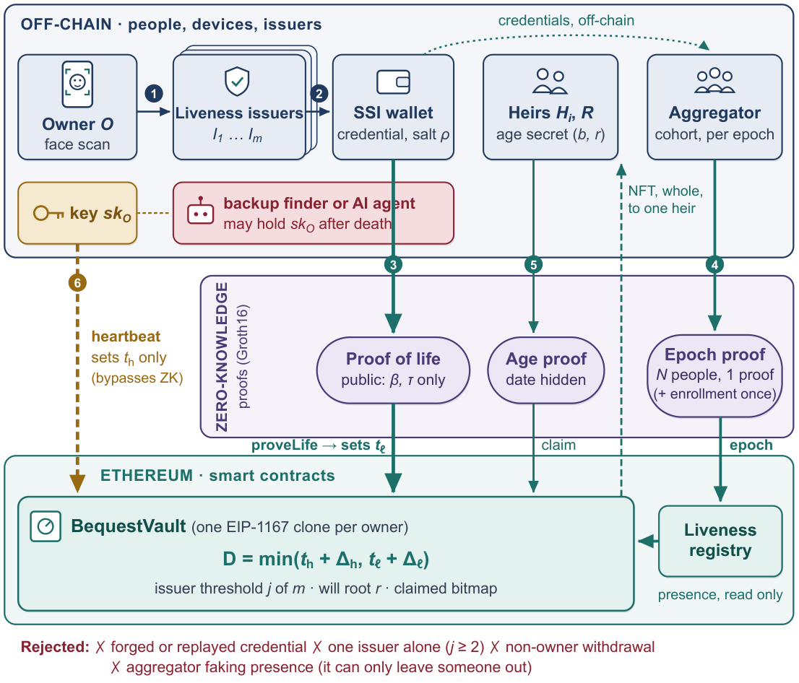

1. The owner creates a vault through the factory: an EIP-1167 clone with four timers, the will's
   Merkle root, a residuary heir, and a binding β = Poseidon(issuer key, subject, salt) that hides
   which identity and issuer stand behind it.
2. From time to time the owner passes a liveness check at an issuer (a face scan in practice). The
   issuer signs a `LivenessCredential` stating the subject was alive at time τ.
3. The owner's device proves, in zero knowledge, that it holds such a credential for the vault's
   binding. The vault verifies the Groth16 proof and moves its life clock to τ. Anyone may relay
   the proof. An optional registry lets one proof cover a whole cohort of vaults per epoch.
4. If the owner stops, time alone moves the vault to Grace and then Claimable. Heirs claim with a
   Merkle proof of their bequest; the first claim settles the vault, and after the claim window the
   rest is swept to the residuary heir.

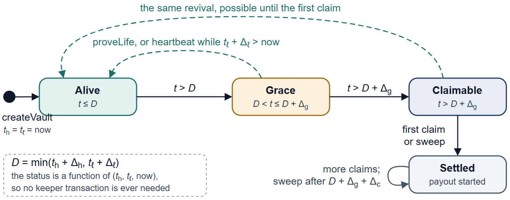

<details>
<summary><b>Message sequence</b> of one vault's life</summary>
<br>
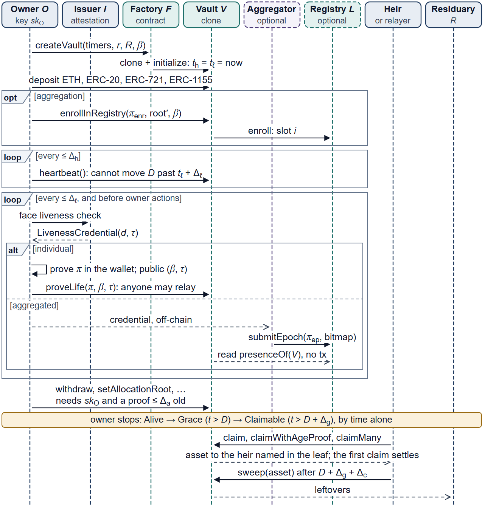
</details>

The diagrams are draw.io files in [`docs/diagrams/`](docs/diagrams/), with PDF and SVG exports.

## Security and assurance

| Evidence | Result |
|---|---|
| Foundry tests: unit, fuzz and invariant | 90 / 90 pass |
| Symbolic execution with Halmos, from an arbitrary vault state under arbitrary calls | 11 / 11 properties proved; 2 / 2 negative controls refuted |
| Circuit tests: honest and manipulated witnesses | 18 cases, all as expected |
| Live run on Sepolia | 30 life-cycle transactions, none reverted; 10 / 10 on-chain attacks and 9 / 9 credential edits rejected |
| Static analysis | Slither (102 detectors, findings triaged) and circomspect |

The properties include: a heartbeat never extends the deadline past $t_\ell + \Delta_\ell$; the
life clock moves only through an accepted proof; nothing is paid before $D + \Delta_g$; owner
actions need the key **and** a proof at most one day old; no bequest is paid twice; no pool is paid
beyond 100 %. Measurements, logs and transaction hashes are in [`code/reports`](code/reports) and
[`code/evidence`](code/evidence).

| Operation (gas) | create a vault | heartbeat | proof of life | claim an NFT | claim ERC-20 | claim with age proof | sweep ETH |
|---|---|---|---|---|---|---|---|
| | 168,899 | 30,049 | 237,400 | 79,914 | 85,271 | 291,560 | 68,281 |

**Trust assumptions and limits.**
- The liveness issuer must attest only live, present people; a vault can require proofs from
  *j* of *m* issuers.
- Groth16 needs a trusted setup. This deployment's phase 2 had a single contributor, which is fine
  for a testnet, not for real assets.
- **The app's demo issuer has a public signing key**, so anyone can produce its "proofs of life". It
  exists so that everyone can try the flow. Use test assets only.
- This is a research prototype and has not been audited.

## Run it yourself

**The app** (Node 22):

```bash
cd dapp
npm ci
npm test          # makes and verifies a proof of life and an age proof in Node
npm run build     # the static site, in dist/
npx serve dist    # or: python -m http.server 5173 -d dist
```

You need a browser wallet on Sepolia and a little Sepolia ETH from any public faucet. The app
mints demo NFTs and hands out demo dollars itself.

**Contracts and circuits** ([Foundry](https://book.getfoundry.sh/)):

```bash
cd code
npm ci
forge build && forge test
```

The [technical manual](MANUAL.md) covers the rest: every state variable and function with its gas,
the symbolic proofs, circuit setup, benchmarks, and a scripted run on Sepolia.

## Deployed on Sepolia

| Contract | Address |
|---|---|
| Vault factory | [`0x03D47801F56f59BBec12D04d3157002538eb2BCa`](https://sepolia.etherscan.io/address/0x03D47801F56f59BBec12D04d3157002538eb2BCa) |
| Vault implementation | [`0x637e3C78C80C6E7FfBa3F00Fe32B43C9355EDfe2`](https://sepolia.etherscan.io/address/0x637e3C78C80C6E7FfBa3F00Fe32B43C9355EDfe2) |
| Liveness registry | [`0x010481ad036E1B4Ee0C8B12d0F46847bF23f484b`](https://sepolia.etherscan.io/address/0x010481ad036E1B4Ee0C8B12d0F46847bF23f484b) |
| Proof-of-life verifier (Groth16) | [`0xEEAC7141D0f022d9634C9834B2BFD982175EA973`](https://sepolia.etherscan.io/address/0xEEAC7141D0f022d9634C9834B2BFD982175EA973) |
| Age verifier (Groth16) | [`0x5b56b4DaEA313f53F7bf8a40fb27672C3E2ba616`](https://sepolia.etherscan.io/address/0x5b56b4DaEA313f53F7bf8a40fb27672C3E2ba616) |
| Demo NFT (anyone can mint) | [`0xaC90BC097ee020F9f9a8323bb0E3F10DA13049C0`](https://sepolia.etherscan.io/address/0xaC90BC097ee020F9f9a8323bb0E3F10DA13049C0) |
| Demo dollar (faucet) | [`0x12eEdD98d9AE04be230f1bF5f4930d4384f61321`](https://sepolia.etherscan.io/address/0x12eEdD98d9AE04be230f1bF5f4930d4384f61321) |

## Repository layout

```
code/        Solidity contracts (src/), Circom circuits, Foundry tests, scripts,
             measurements (reports/) and evidence of the Sepolia runs
dapp/        the web app: src/ (interface and core modules), public/circuits (circuits and
             proving keys), test/, tools/ (demo vaults and screenshots)
docs/        screenshots and diagrams (draw.io sources with PDF, SVG and PNG exports)
MANUAL.md    technical manual
```

Solidity 0.8.28 · Foundry · OpenZeppelin 5 · Circom 2.1.9 · snarkjs 0.7.5 (Groth16 on BN254) ·
iden3 credentials (Baby Jubjub EdDSA-Poseidon, JSON-LD merklization) · Halmos · Slither ·
ethers 5 · esbuild · GitHub Actions and Pages

## License

[MIT](LICENSE) © 2026 Sanjoy Chattopadhyay. The Groth16 verifier contracts generated by snarkjs
(`code/src/verifiers/`) and the bundled `snarkjs.min.js` are GPL-3.0, as their headers say.
